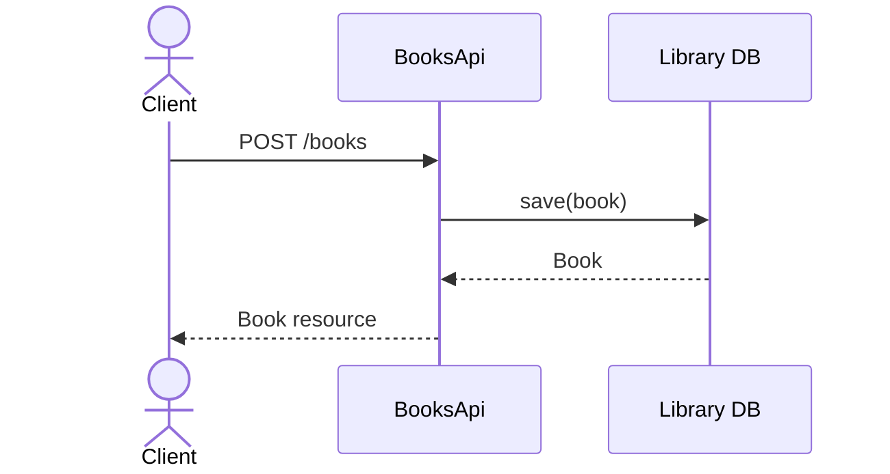
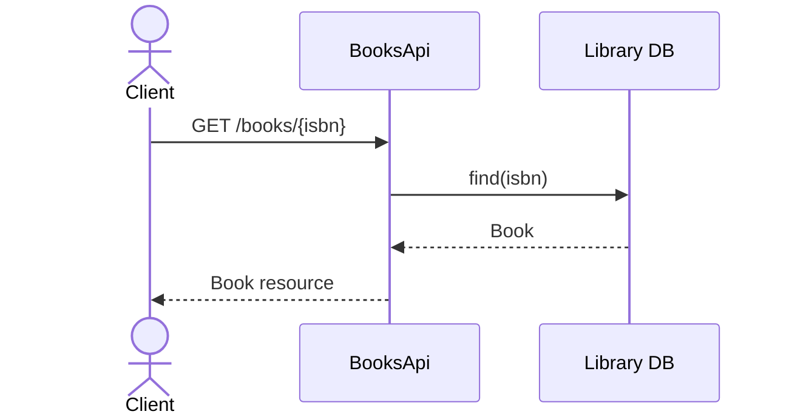
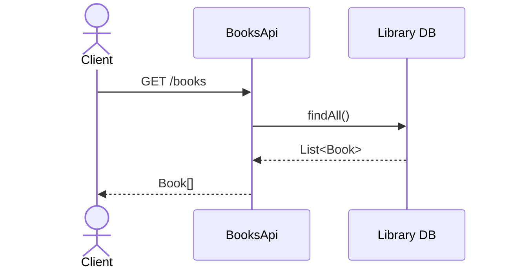

This is an API First example of Books API.

# Introduction

## Use Cases

### Use Case 1: Store a new Book in the library 

### Use Case 2: Get a book by isbn 

### Use Case 3: Get all books 


# Quickstart
Clone API from [github project](https://github.com/enisspahi/code-first-api-example) and run
````
./gradlew bootRun
````
Then try out the api calls.